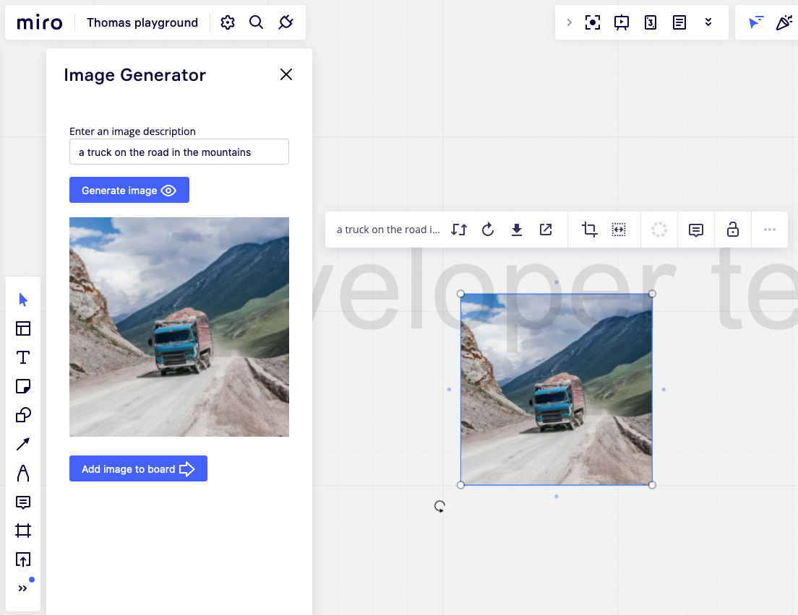

# Miro Image Generator

Generate unique images from a text description, directly in your Miro board!



The image description can be entered manually, or by selecting an item on your board, such as a sticky note.

Images are created by the [OpenAI Dall-E 2 model](https://openai.com/dall-e-2/), available through the [Image Generation API](https://beta.openai.com/docs/guides/images/introduction).

## Development

The Image Generator app was created using [`create-miro-app`](https://www.npmjs.com/package/create-miro-app).

This app uses [Vite](https://vitejs.dev/). If you want to modify the `vite.config.js` configuration, see the [Vite documentation](https://vitejs.dev/guide/).

A valid [OpenAI API key](https://beta.openai.com/docs/api-reference/authentication) is required, it can be configured in a git-ignored `.env.local` file as
```
VITE_OPENAI_API_KEY=<your-key-here>
```

### How to start locally

- Run `npm i` to install dependencies.
- Run `npm start` to start developing. \
  Your URL should be similar to http://localhost:3000
- Paste the URL under **App URL** in your
  [app settings](https://developers.miro.com/docs/build-your-first-hello-world-app#step-3-configure-your-app-in-miro).
- Open a board; you should see your app in the app toolbar or in the **Apps**
  panel.

### How to build the app

- Run `npm run build`. \
  This generates a static output inside [`dist/`](./dist), which you can host on a static hosting service.

### Folder structure

<!-- The following tree structure is just an example -->

```
.
├── src
│  ├── assets
│  │  └── style.css
│  ├── app.ts      // The code for the app lives here
│  └── index.ts    // The code for the app entry point lives here
├── app.html       // The app itself. It's loaded on the board inside the 'appContainer'
└── index.html     // The app entry point. This is what you specify in the 'App URL' box in the Miro app settings
```

**&nbsp;ℹ&nbsp;Note**:

- A Chromium-based web browser is recommended for local development with HTTP. \
  Safari enforces HTTPS; therefore, it doesn't allow localhost through HTTP.
- For more information, visit the [Miro developer documentation](https://developers.miro.com).
